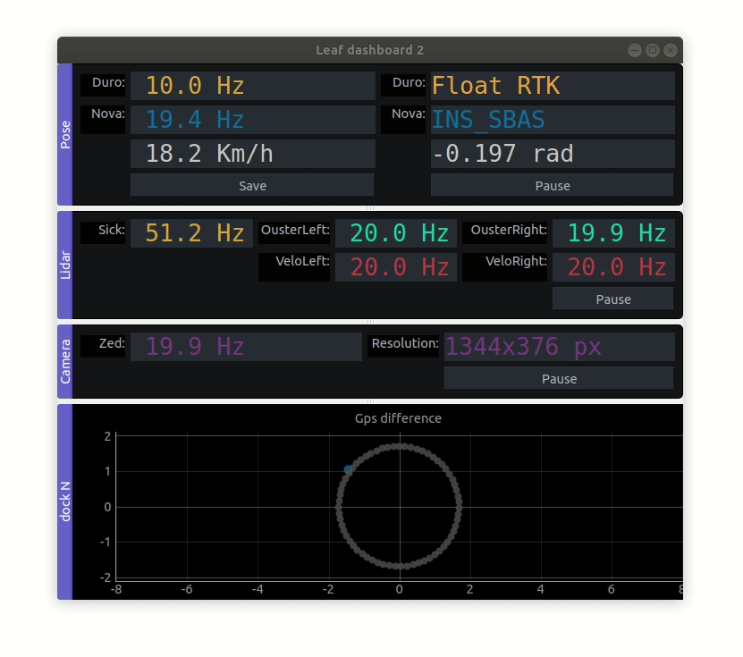

# szenergy-utility-programs
Utility programs useful for every vehicle

- [bag_scripts](bag_scripts/): handy rosbag-related scripts in python, shell and MATLAB 
- [gps_tf_publisher](gps_tf_publisher/): TF publisher from a GPS topic in ROS
- [gps_quick_compare](gps_quick_compare/): a really simple node which compares two gps given in UTM (Universal Transverse Mercator coordinate system) and publishes the orientation and position difference 
- [configs](configs/): saved rviz / plotjuggler / rqtmultiplot configurations
- [ros_guis](ros_guis/): Some useful ROS related GUI programs such as Leaf dashboard in pyqt: 

