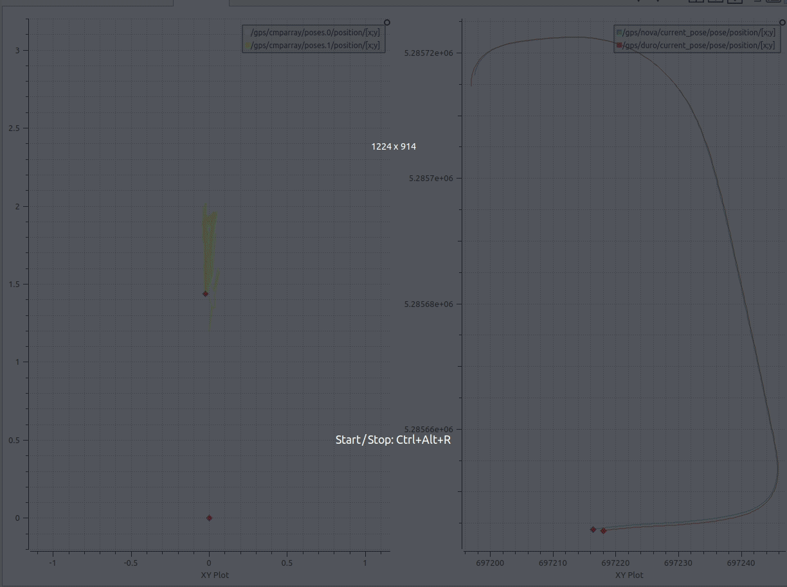

# gps_quick_compare
A really simple node which compares two gps given in UTM (Universal Transverse Mercator coordinate system) and publishes the orientation and position difference.

 * pubishes topic: 
   * `/gps/cmparray`
 * subscribes to: 
   * `/gps/duro/current_pose`
   * `/gps/nova/current_pose`
