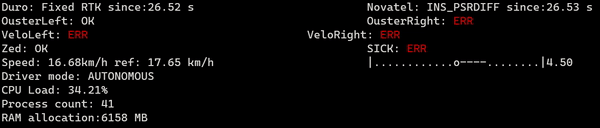

# ROS command line

Terminal based diagnostic tool which comes handy for autonomous developments

## sensor_diagnostics



## diagnostics_cmdl.py

```
pip install nvidia-ml-py3
pip install colorama
```
