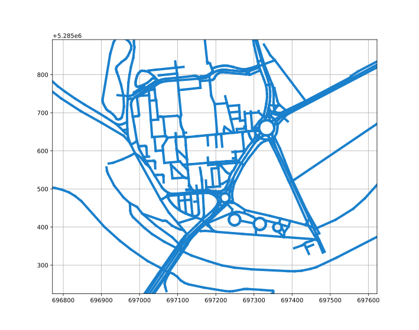

# Experimental feature to publish openstreetmap (OSM) data in RVIZ

`osm_utm_matplotlib.py` is based on source listed in references, and it plots an OSM XML map in Universal Transverse Mercator (UTM).

E.g. our campus in Győr:

# References
- http://code.activestate.com/recipes/534109-xml-to-python-data-structure/