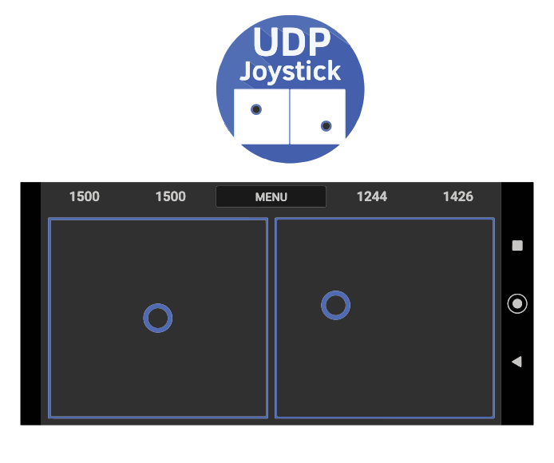
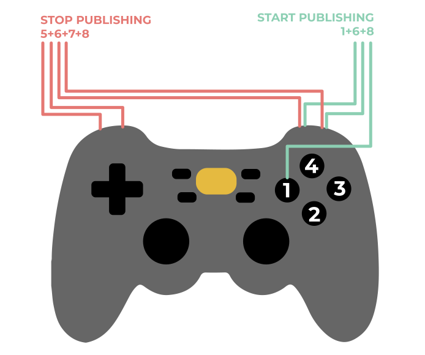
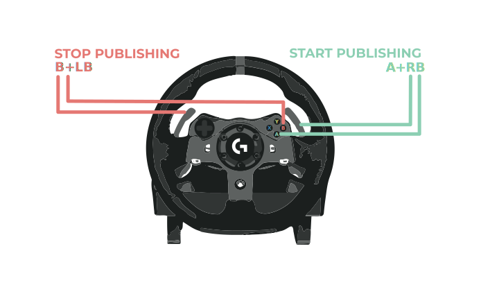

# UDP Joystick Android-ROS interface 

## What is `udp_joystick_ros` package?
This is a simple Android-ROS interface to control robots / simulators / vehicles from an Android-based touchscreen joystick. (*Also the newer scripts support devices such as Logitech G920 and Logitech Cordless Rumblepad 2, so not everything is UDP-based, so the package name is not consistent, sorry*)
## Usage
### Step 1.
Download UDP Joystick Android app from [Google Play Store](https://play.google.com/store/apps/details?id=com.denods.udpjoystick&hl=en&gl=US). This app is free and ad-free it only sends UPD packets to the destiination IP from the touchscreen-joystick.
### Step 2.
Download and `catkin build` the `udp_joystick_ros`. (Don't forget to source).
### Step 3.
Set the IP-s and ports and run both the App and the ROS package. The default port is `50505`, but you can change it.
```
rosrun udp_joystick_ros control_simulator.py
rosrun udp_joystick_ros control_vehicle.py
rosrun udp_joystick_ros control_vehicle.py _udp_port:=50506
```
This will publish a ROS topic eg with the following name and type:
```
/ctrl_cmd       [autoware_msgs/ControlCommandStamped]
/vehicle_cmd    [autoware_msgs/VehicleCmd]
```

## `control_simulator.py` and `control_vehicle.py`


## `gamepad_control_vehicle.py`



## `wheel_control_vehicle.py`

